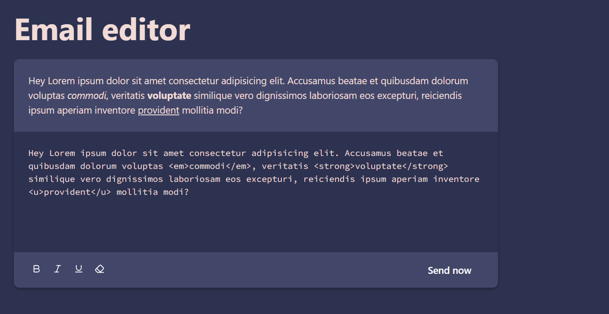

# Email Editor

### About:
A small text editor created for learning and practicing TypeScript and SASS. Its features include italic, underline, and bold text formatting. Additionally, users can add the edited text to a sent emails panel on the right side of the interface.

### Demo:

### Technologies Used:

### Packages Used:
- [HTMLReactParser](https://www.npmjs.com/package/html-react-parser)
- [Lucide React](https://www.npmjs.com/package/lucide-react)

### Other Links:

- [Palette](https://colorhunt.co/palette/2d32504247697077a1f6b17a)
- [Icons](https://lucide.dev/)

